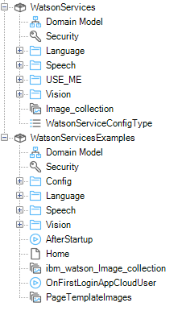
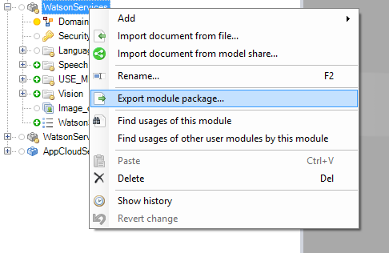
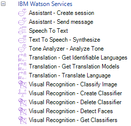

# IBM Watson Connector Suite

The IBM Watson Connector Suite is a collection of connectors that brings the [IBM Watson cognitive services](https://www.ibm.com/watson/developercloud/) to the Mendix platform.

## Try it out an example in Bluemix

1. Deploy an example application using the Mendix's IBM Watson Connector Suite by clicking on the following button (or follow [this documentation](documentation/deploy-bluemix-button.md)). [](https://bluemix.net/deploy?repository=https://github.com/mendix/IBM-Watson-Connector-Suite.git)

2. When possible, IBM watson services should be automatically configured. To check the service and configure the Alchemy service manually please refer to the [documentation here](documentation/usage.md).

## Getting Started with the connectors

With this project and you will be ready to go using the [Mendix Modeler](https://appstore.home.mendix.com/index3.html) to deploy locally or in the Mendix free tier (because this is an example app plus the connectors that point to several IBM Watson services).

### Prerequisities

* Mendix user account (sign up [here](https://www.mendix.com/try-now/))
* IBM Bluemix account (sign up [here](https://console.ng.bluemix.net/registration/))
* Mendix Modeler (only Windows-compatible) (download [here](https://appstore.home.mendix.com/index3.html))

### Features

These are the Watson APIs that have a connector implemented:

* AlchemyLanguage – [Keywords](https://www.ibm.com/watson/developercloud/alchemy-language/api/v1/#keywords)
* Conversation – [Send Message](http://www.ibm.com/watson/developercloud/conversation/api/v1/#send_message)
* Language Translation – [Translate](http://www.ibm.com/watson/developercloud/language-translation/api/v2/#translate)
* Language Translation – [Get Identifiable Languages](http://www.ibm.com/watson/developercloud/language-translation/api/v2/#identifiable_languages)
* Text to Speech – [Synthesize](http://www.ibm.com/watson/developercloud/text-to-speech/api/v1/#synthesize audio)
* Tone Analyzer – [Analyze Tone ](https://www.ibm.com/watson/developercloud/tone-analyzer/api/v3/#post-tone)
* Visual Recognition – [Classify Image](http://www.ibm.com/watson/developercloud/visual-recognition/api/v3/#classify_an_image)
* Visual Recognition – [Create Classifier](http://www.ibm.com/watson/developercloud/visual-recognition/api/v3/#create_a_classifier)
* Visual Recognition - [Detect Faces](http://www.ibm.com/watson/developercloud/visual-recognition/api/v3/#detect_faces)

### Installation

The project includes two modules that represent the list of available connectors and examples. Both modules are structured following the same categories used by IBM in its portfolio:



To be able to use the Watson Connector Suite in your project, you have to export the WatsonServices module and import it into the project where you want to use it:



Once you have imported the module into your project, you will have at your disposal the collection of new IBM Watson connectors to use in any microflow:



### Configuration

In your IBM Bluemix console, every instance of a Watson service will have a section called "Service credentials", which will provide you the data in a format like this:

```
{
  "credentials": {
    "url": "<SERVICE_URL_PROVIDED_BY_IBM_BLUEMIX>",
    "note": "It may take up to 5 minutes for this key to become active",
    "apikey": "<YOUR_API_KEY>"
  }
}
```

Alternatively, if the service does not require an API key, it will instead require a username and password:

```
{
  "credentials": {
    "url": "<SERVICE_URL_PROVIDED_BY_IBM_BLUEMIX>",
    "password": "<YOUR_PASSWORD>",
    "username": "<YOUR_USERNAME>"
  }
}
```
Please follow the instructions in the example app to provide the service with the necessary credentials.

## Dependencies

The Watson Connectors Suite will install the following dependencies in your project's *userlib* folder:

* java-sdk-x.y.z-jar-with-dependencies.jar
* org.apache.commons.io-2.3.0.jar
* org.apache.commons.lang3.jar

> Note: Please be aware if you upgrade The Watson Connector Suite in your project, you will have to remove manually the old version of these dependencies.

## Known issues

The ChatWidget doesn't show the username properly when the example app is deployed in a sandbox.

## Build Details

This was built with the following:

* Mendix Modeler 6.6.0
* Eclipse IDE Neon

## Versioning

We use [SemVer](http://semver.org/) for versioning. For the versions available, see the [tags on this repository](https://github.com/mendix/IBM-Watson-Connector-Kit/tags).

## License

This project is licensed under the Apache License v2 (for details, see the [LICENSE](LICENSE-2.0.txt) file).
