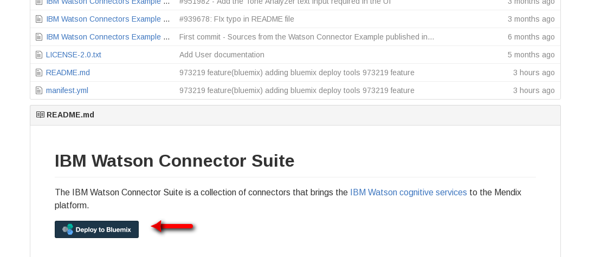
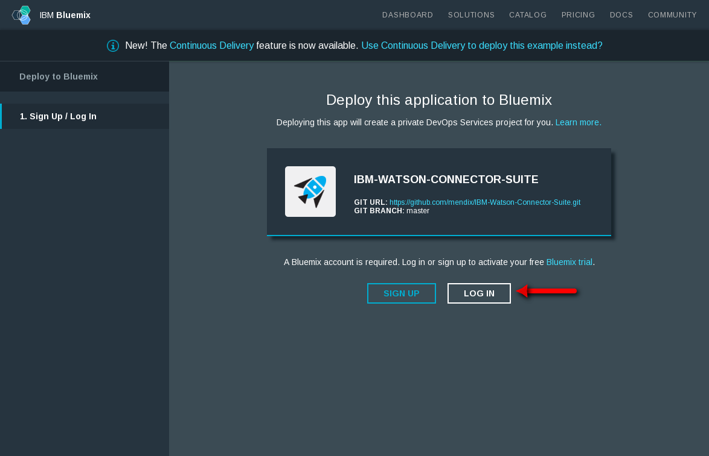
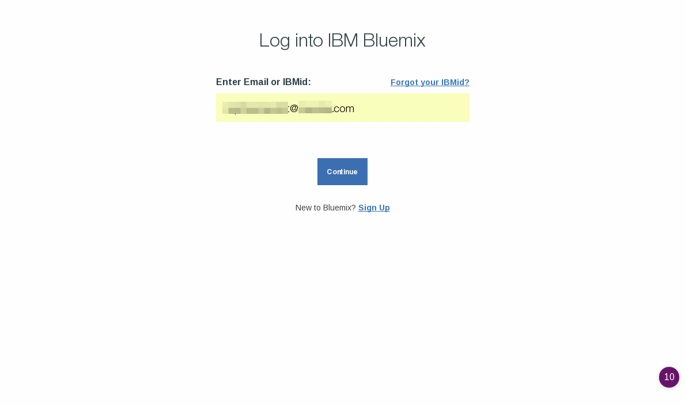
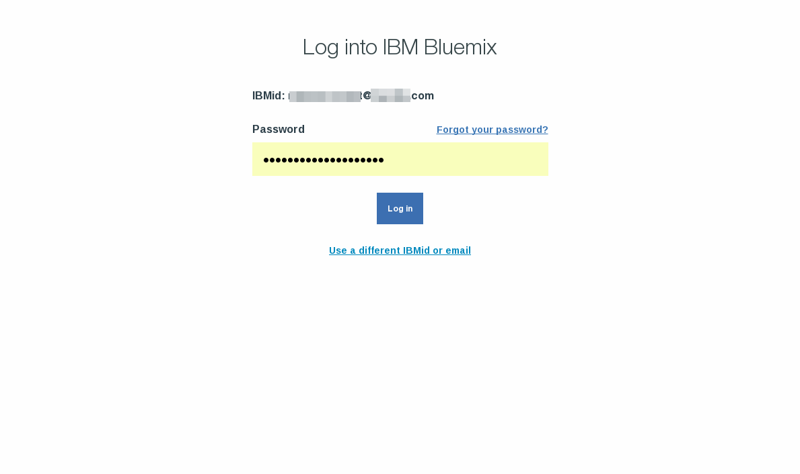
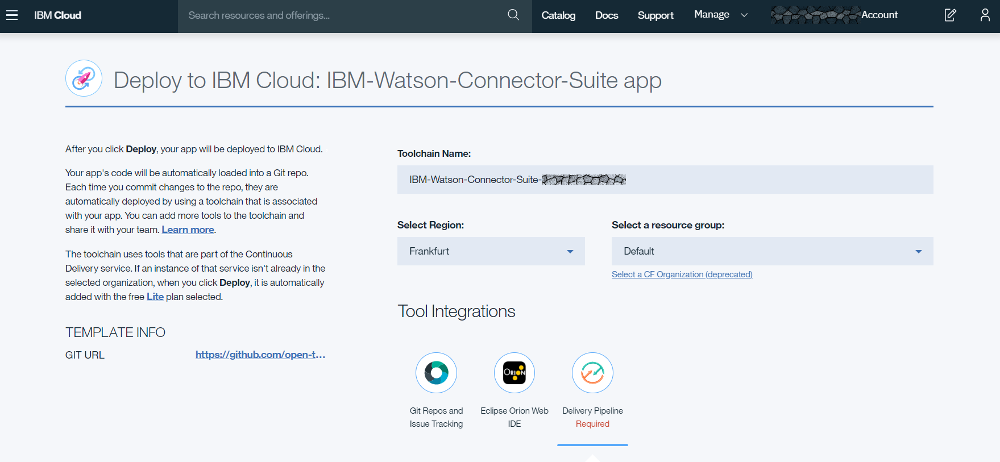
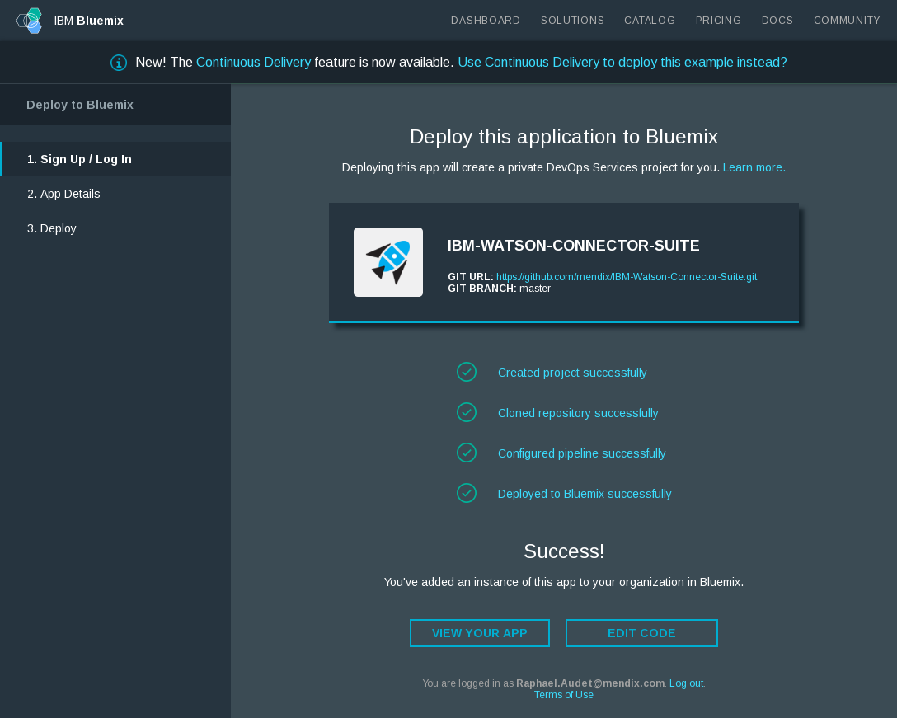
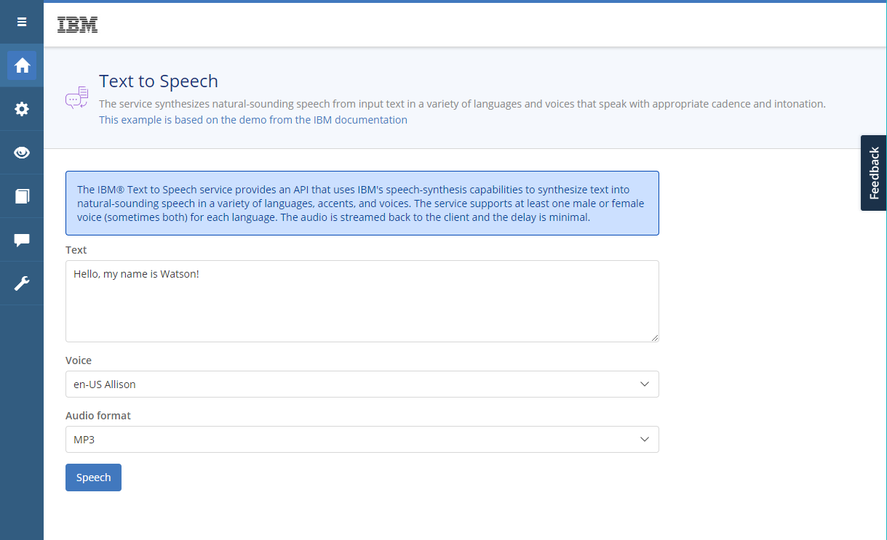

# Deploy the example IBM Watson Connector suite application to IBM Cloud

1. Click on the "Deploy to IBM Cloud" button

    

    

2. Deploying to IBM Cloud with use the IBM DevOps services, click on "Log In" (or "sign up" if you do not have an account)

3. Sign-in to IBM Cloud with your account

4. Provide your IBM Cloud account password to complete the sign-in

5. Provide the toolchain name, the region and the resource group
    
    > At the moment, the [Visual Recognition v3 API](https://cloud.ibm.com/apidocs/visual-recognition) is hosted only in the Dallas location. Choosing another region will likely cause the deployment to fail.
6. Provide the application name, the region, the organization and the space for your IBM Cloud application and click "Deploy"

7. The application will take a couple minutes to deploy, once the application has been deployed with success, click on "view your app"

8. You can now use the Mendix example IBM Watson Connector suite

