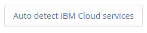

# Use the Mendix Example Application of the IBM Watson Connectors examples

1. After deploying the Mendix Application to IBM Cloud and signing-in in your Example application, verify that the IBM Cloud services are recognized by entering the configuration menu

2. Check your linked services from you IBM Cloud application dashboard, in the connected services.

3. The IBM Example Application should have one configuration entry per service in IBM Cloud.

4. Press the

    

    button to (re-)discover Watson services connected to the application.

5. The service credentials labels should match the following items:

  * tone_analyzer (Watson Tone Analyzer)
  * language_translator (Watson Language Translator)
  * conversation (Watson Assistant)
  * watson_vision_combined (Watson Visual Recognition)
  * text_to_speech (Watson Text to Speech)
  * speech_to_text (Watson Speech to Text)
