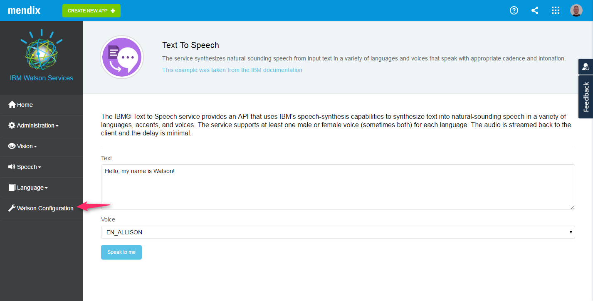
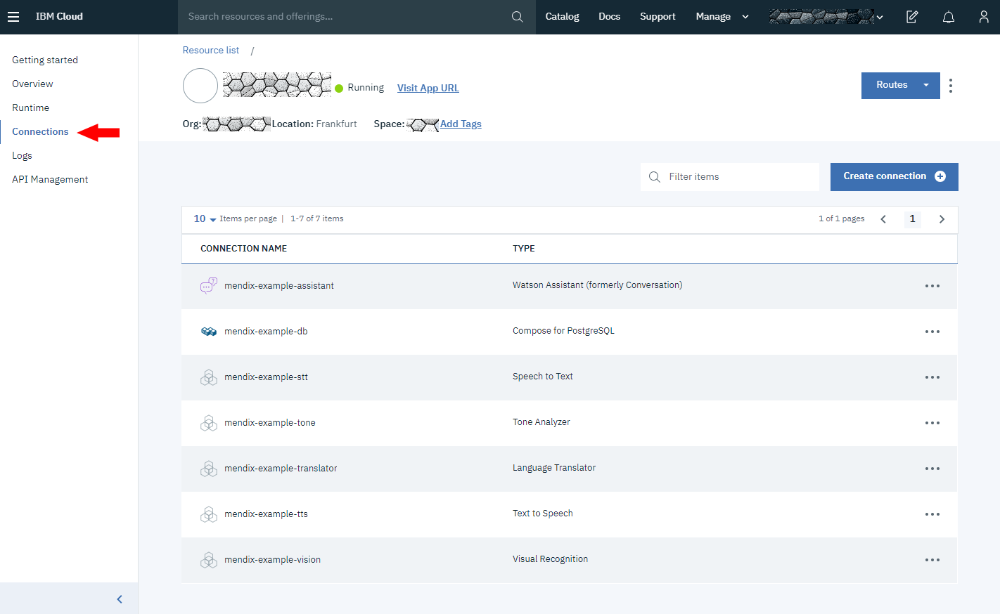
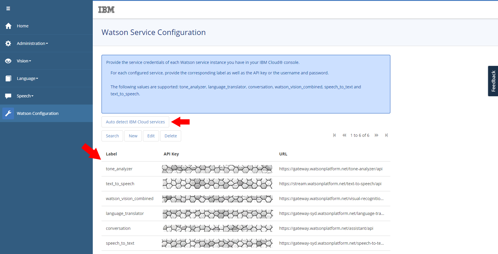

# Use the Mendix Example Application of the IBM Watson Connectors examples

1. After deploying the Mendix Application to IBM Bluemix and signing-in in your Example application, verify that the IBM Bluemix services are recognized byt entering the configuration menu

2. Check your linked service from you IBM Bluemix application dashboard, in the connected services. The Alchemy service cannot be configured automatically, please add and link the service manually.

3. The IBM Example Application should have a one configuration service per service in IBM Bluemix. 

4. The service credentials should match the following items:

  * alchemy_api
  * tone_analyzer
  * language_translator
  * conversation
  * watson_vision_combined
  * text_to_speech
